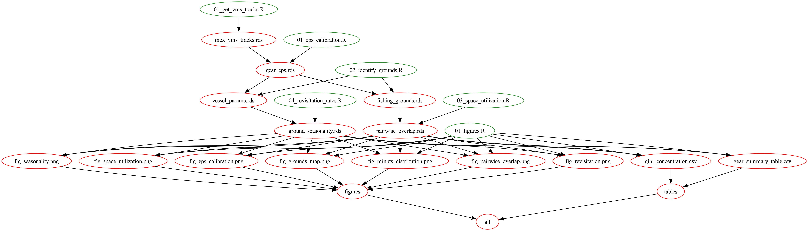

# Data and code for "A data-driven method for identifying fisher-level fishing grounds from vessel-tracking data"

## Pipeline

The analysis pipeline is managed with `make`. Run `make` from the project root to rebuild all outputs, or target individual files (e.g., `make data/output/fishing_grounds.rds`).

### Scripts

**Processing**

| Script | Outputs |
|---|---|
| `01_processing/01_get_vms_tracks.R` | `data/raw/mex_vms_tracks.rds` |
| `01_processing/02_prepare_tracks.R` | `data/processed/gear_summary.rds`, `vessel_summary.rds` |

**Analysis**

| Script | Outputs |
|---|---|
| `02_analysis/01_eps_calibration.R` | `data/output/gear_eps.rds`, `per_vessel_eps.rds` |
| `02_analysis/02_identify_grounds.R` | `data/output/fishing_grounds.rds`, `vessel_params.rds` |
| `02_analysis/03_space_utilization.R` | `data/processed/vessel_area.rds`, `pairwise_overlap.rds`, `gini_concentration.rds` |
| `02_analysis/04_revisitation_rates.R` | `data/processed/visit_dates.rds`, `inter_visit_intervals.rds`, `ground_seasonality.rds` |

**Content**

| Script | Outputs |
|---|---|
| `03_content/01_figures.R` | `results/img/fig_*.png`, `results/tab/*.csv` |
