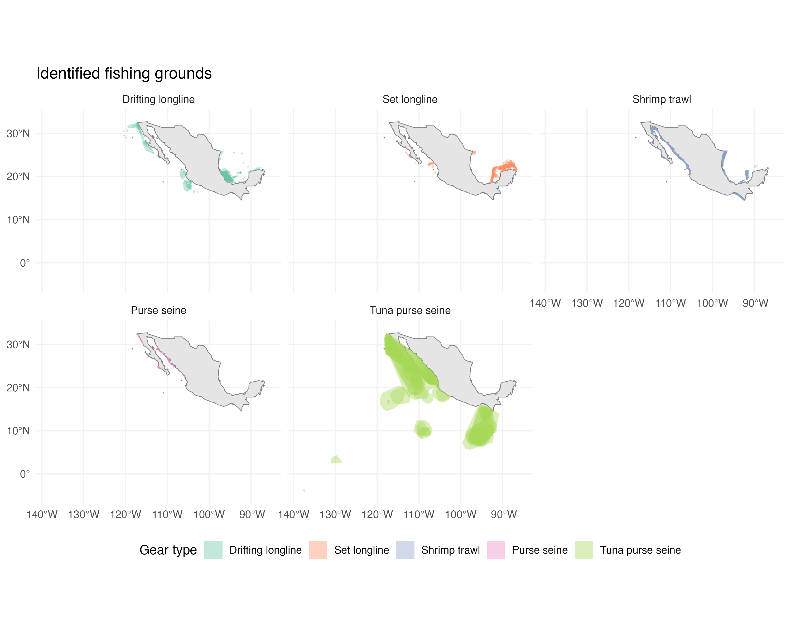
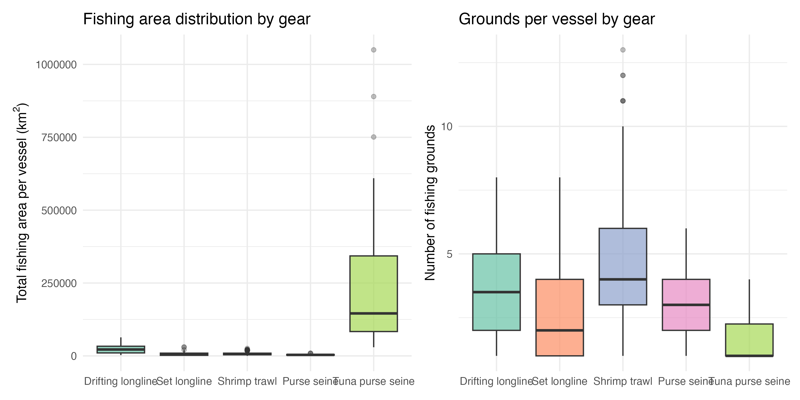
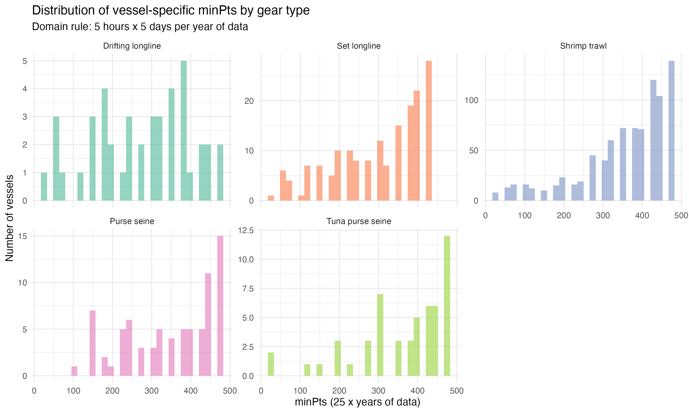
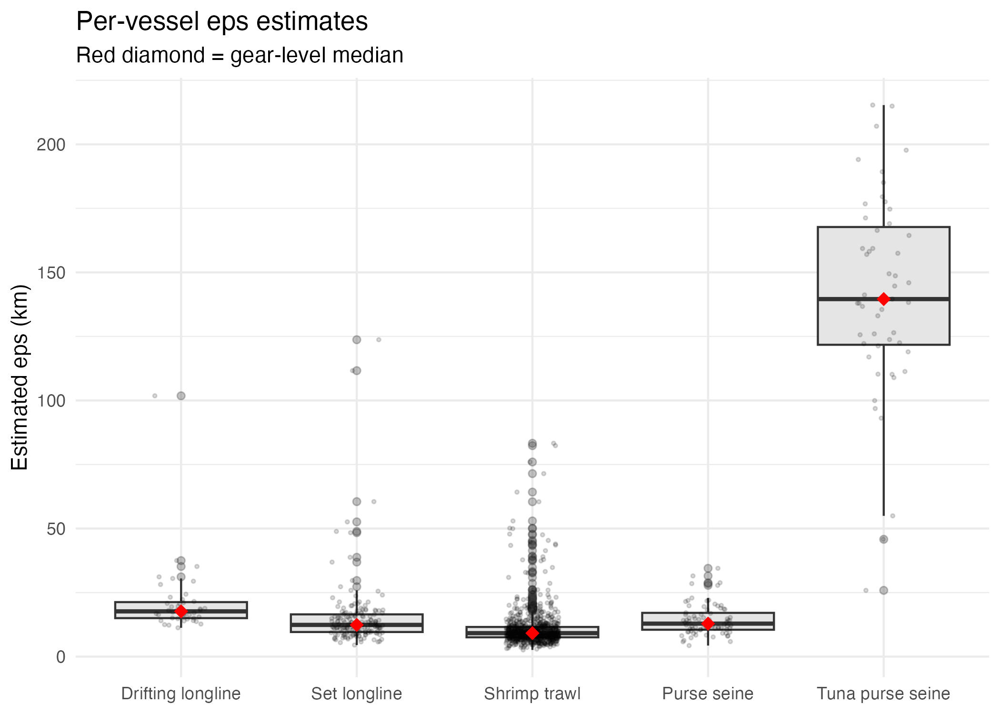
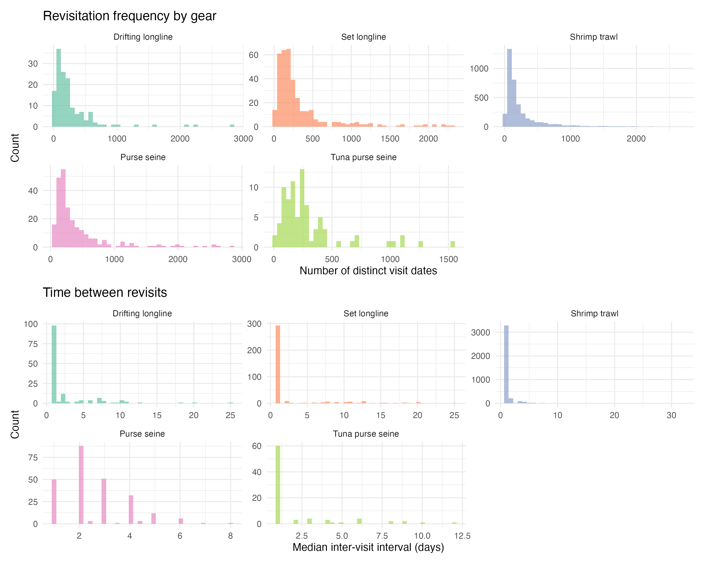
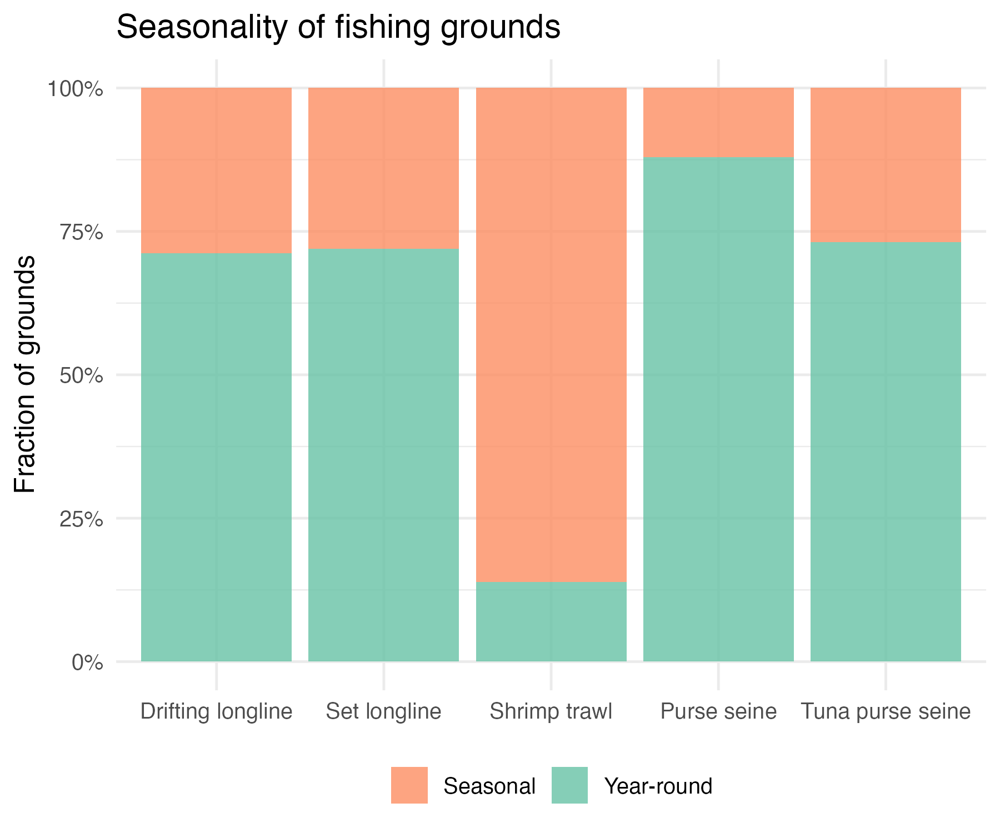

```{r setup}
pacman::p_load(here, tidyverse, sf, knitr)
sf_use_s2(FALSE)

gear_labels <- c(shrimp_trawl = "Shrimp trawl",
                 set_longline = "Set longline",
                 drifting_longline = "Drifting longline",
                 small_pelagic_purse_seine = "Purse seine",
                 tuna_purse_seine = "Tuna purse seine")

fishing_grounds <- read_rds(here("data/output/fishing_grounds.rds"))
vessel_params <- read_rds(here("data/output/vessel_params.rds"))
gear_eps <- read_rds(here("data/output/gear_eps.rds"))
gear_summary <- read_rds(here("data/processed/gear_summary.rds"))
vessel_area <- read_rds(here("data/processed/vessel_area.rds"))
gini <- read_rds(here("data/processed/gini_concentration.rds"))

grounds <- fishing_grounds |> filter(fg_hours > 0)
n_grounds <- nrow(grounds)
n_vessels <- n_distinct(grounds$vessel_rnpa)
n_gears <- n_distinct(grounds$gear_type)
```

# Methods

We identified fisher-level fishing grounds from Mexican Vessel Monitoring System (VMS) data using DBSCAN density-based clustering. The analysis covers `r n_gears` gear types: shrimp trawl, set longline, drifting longline, small pelagic purse seine, and tuna purse seine. Raw VMS pings were filtered by gear-specific speed thresholds and a minimum distance of 1 km from shore.

**minPts (domain-based rule).** We define a fishing ground as a location with at least 5 hours of fishing activity on at least 5 distinct days per year. Since VMS pings are recorded at approximately hourly intervals, this translates to a base threshold of 25 pings per vessel-year of data. For each vessel, minPts = 25 $\times$ $N_{\text{years}}$, where $N_{\text{years}}$ is the number of distinct calendar years in the vessel's track. This scaling ensures that vessels with longer records must demonstrate sustained, repeated use of a location for it to qualify as a fishing ground.

**eps (kNN elbow method).** The neighbourhood radius was calibrated per gear type using per-vessel $k$-nearest-neighbour distance curves with $k$ = 25. For each qualifying vessel (those with $\geq$ 50 pings), we computed the sorted $k$-NN distance curve and detected the elbow via the simplified kneedle algorithm (maximum perpendicular distance from the line connecting the first and last points). The gear-level eps is the median of all per-vessel elbow estimates.

```{r tbl-params}
#| label: tbl-params
#| tbl-cap: "DBSCAN parameters by gear type. eps is the gear-level median of per-vessel kNN elbow estimates. minPts varies per vessel (shown as median across vessels in each gear)."

vp_gear <- vessel_params |>
  inner_join(
    read_rds(here("data/raw/mex_vms_tracks.rds")) |>
      distinct(vessel_rnpa, gear_type),
    by = "vessel_rnpa"
  )

param_table <- gear_eps |>
  inner_join(
    vp_gear |>
      group_by(gear_type) |>
      summarise(
        median_minpts = median(min_pts),
        min_minpts = min(min_pts),
        max_minpts = max(min_pts),
        .groups = "drop"
      ),
    by = "gear_type"
  ) |>
  mutate(
    Gear = gear_labels[gear_type],
    `eps (km)` = round(eps / 1e3, 1),
    `Median minPts` = median_minpts,
    `Range minPts` = paste0(min_minpts, "--", max_minpts)
  ) |>
  select(Gear, `eps (km)`, `Median minPts`, `Range minPts`)

kable(param_table)
```

After clustering, each cluster's convex hull defines a fishing ground. We computed ground area, total fishing hours, number of pings, and number of distinct visit dates per ground.

# Results

We identified **`r format(n_grounds, big.mark = ",")`** fishing grounds across **`r n_vessels`** vessels (@tbl-summary). @fig-map shows the spatial distribution of identified grounds.

```{r tbl-summary}
#| label: tbl-summary
#| tbl-cap: "Summary of identified fishing grounds by gear type."

gear_table <- vessel_area |>
  group_by(gear_type) |>
  summarise(
    `Vessels` = n(),
    `Total grounds` = sum(n_grounds),
    `Median grounds/vessel` = median(n_grounds),
    `Median area (km2)` = round(median(total_area_km2), 1),
    `Median hours` = round(median(total_fg_hours), 1),
    .groups = "drop"
  ) |>
  mutate(Gear = gear_labels[gear_type]) |>
  select(Gear, everything(), -gear_type)

kable(gear_table)
```

{#fig-map width=100%}

@fig-space shows the distribution of total fishing area and number of grounds per vessel. Most vessels operate across a modest number of grounds, though the range varies considerably by gear.

{#fig-space width=100%}

@fig-minpts shows how the domain-based minPts rule distributes across vessels in each gear type. The spread reflects differences in how many years of VMS data each vessel has.

{#fig-minpts width=100%}

@fig-eps shows the per-vessel eps estimates used to calibrate the gear-level neighbourhood radius.

{#fig-eps width=80%}

@fig-revisit characterises how frequently vessels return to their identified grounds and the typical time between revisits.

{#fig-revisit width=100%}

{#fig-season width=60%}
